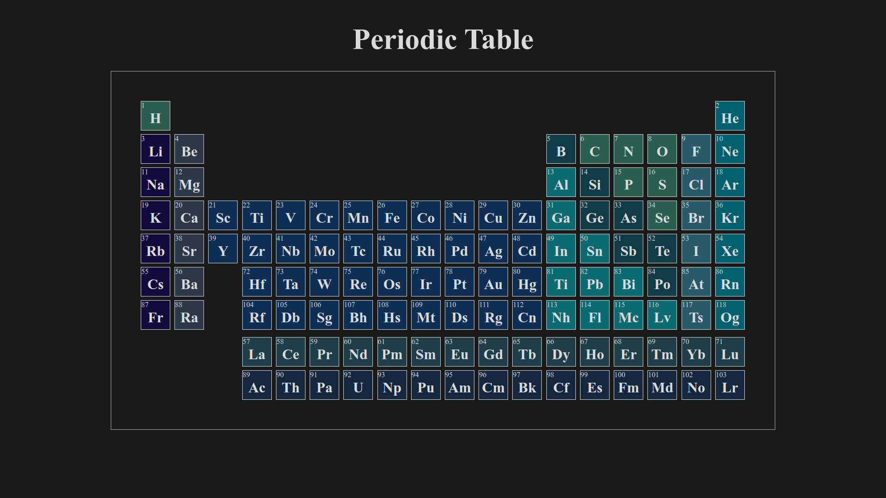
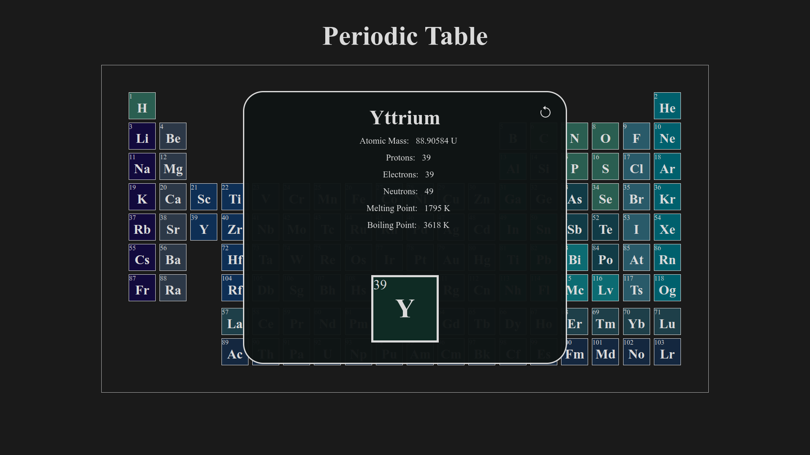

# The Periodic Table for Web

## Summary

- Project
- Git Clone

## Project

The project is a periodic table for web developed using html,css,javascript and sass.


> link to project  https://web-periodic-table.netlify.app

<div align="center">





</div>

## Git Clone

```sh
> git clone https://github.com/cleytonmanoel/Periodic-Table-For-web.git
```

